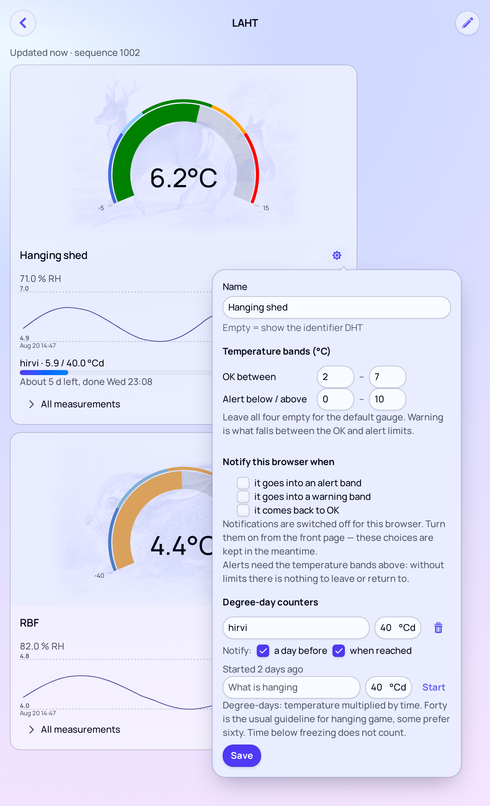

# ScrewCloud

**OSS web app to monitor temperature sensors like Ruuvi Tags and other custom sensors.**

A screw driven into a cloud: self-hosted temperature monitoring where the
readings go to your own server rather than into somebody else's cloud.

There are two firmware variants, both speaking the same protocol to the same
server:

- **`temperature-reader`** for the Raspberry Pi Pico 2 W — the full version:
  RuuviTags over BLE, an optional wired DHT22, an optional OLED, and WiFi or
  NB-IoT for connectivity.
- **`esp32-s3-reader`** for the ESP32-S3 — minimal: RuuviTags and WiFi, nothing
  else.

The server is a Spring Boot + Vaadin application that stores the measurements and
shows them in a browser.



Each sensor gets a card with a gauge, the last 24 hours as a curve, and every
reading behind a collapsed section. The settings open from the cog: a name,
temperature bands for the gauge, and which of that sensor's alerts this browser
wants as push notifications.

## Quick start (Pico 2 W)

Minimum hardware: a **Raspberry Pi Pico 2 W** and a **RuuviTag**. No DHT22, no
display, no NB-IoT modem — those are all optional and detected at runtime.

For an ESP32-S3 instead, see [esp32-s3-reader](#esp32-s3-reader).

1. **Install the Arduino core.** Boards Manager → *Raspberry Pi Pico/RP2040/RP2350*
   by Earle Philhower. Select the board *Raspberry Pi Pico 2 W*.

2. **Set Tools → IP/Bluetooth Stack → `IPv4 + Bluetooth`.** Mandatory: BLE is
   needed to hear the RuuviTag and WiFi to send. Without it the sketch will not
   even compile.

3. **Install the libraries** from Library Manager. Only the DHT ones can be
   skipped, and only if you comment out `ENABLE_DHT22`:

   | Library | Needed for |
   |---|---|
   | `Adafruit SH110X` + `Adafruit GFX Library` | the optional OLED |
   | `DHT sensor library` + `Adafruit Unified Sensor` | the optional DHT22 |

4. **Create your configuration** from the template and edit the copy:

   ```bash
   cd temperature-reader
   cp config.h.example config.h
   ```

   `config.h` is git-ignored because it holds your WiFi password. For the
   minimum setup only three lines need changing:

   ```c
   static const char DEVICE_ID[5] = "ABCD";        // any 4 characters, your own
   static const char WIFI_SSID[] = "your-network";
   static const char WIFI_PASSWORD[] = "your-password";
   ```

   Leave `SERVER_HOST` alone to use the public demo server.

5. **Flash it and open the serial monitor** at 115200 baud. Within a minute you
   should see something like:

   ```
   No NB-IoT modem found, falling back to WiFi
   Transport: WiFi
   DHT22: not connected
   RuuviTag cold room / F3:19:1A:C0:8E:BF  RSSI -41 dBm  (280 ms ago)
   Send ok: 1 sensors, 16 bytes, sequence 1
   ```

6. **Open the server**, enter your `DEVICE_ID` and press Add. The first packet
   arrives 30 s after boot, then every 5 minutes.

The onboard LED tells you the state from across the room: two short flashes and
a long pause means the last send succeeded, fast steady pulsing means it failed.

### Demo server

The default `SERVER_HOST` points at the public demo server **r.pakast.in**
(77.42.75.251, UDP 5555). You are welcome to use it for trying things out.

**It comes with no guarantees.** It may be down, and the database may be wiped
at any time without warning. There is no authentication either: anyone who knows
your `DEVICE_ID` can see your readings, and anyone can send readings claiming to
be your device. For anything you care about, run your own server — a Spring Boot
jar and a PostgreSQL, see [Server](#server).

### What is optional and how

| Part | Behaviour when absent |
|---|---|
| DHT22 | Detected at runtime. After `DHT_FAILURES_BEFORE_ABSENT` failed reads it is declared absent, stops being read, and is left out of the display and the packet. Its display row goes to the tags instead. |
| OLED display | Nothing to detect — 4-wire SPI has no read-back, so the sketch cannot tell whether a display is attached and simply draws into the void. Nothing fails either way. |
| NB-IoT modem | Probed with an AT command at boot (`TRANSPORT_AUTO`). If it does not answer, WiFi is used. |
| RuuviTags | Any number from zero upwards. With no readings at all the sketch skips sending rather than transmitting an empty packet. |
| Chip temperature | Always available — it is on the die, there is nothing to detect or wire. Comment out `ENABLE_INTERNAL_TEMPERATURE` to leave it out of the packet. |

A sensor is only declared absent while it has **never** produced a reading. One
that has worked keeps being retried forever, because then the problem is
interference rather than absent hardware.

`TRANSPORT_AUTO` compiles both transports in and costs a couple of seconds of
boot time when no modem is present. `TRANSPORT_WIFI` or `TRANSPORT_NBIOT` fix
the choice and avoid both.

## Repository layout

| Directory | Description |
|---|---|
| `temperature-reader/` | Full firmware for the Raspberry Pi Pico 2 W: RuuviTags, DHT22, OLED, WiFi or NB-IoT |
| `esp32-s3-reader/` | Minimal firmware for the ESP32-S3: RuuviTags and WiFi only |
| `server/` | Spring Boot + Vaadin: receives the UDP packets and shows the latest readings |
| `tools/` | `check-protocol-sync.sh`, which verifies the two firmwares agree on the wire format, and `generate-vapid-keys.java` for web push |

Both firmwares speak the same protocol to the same server, so a single server
can collect from a mix of Pico and ESP32 devices.

## Hardware

| Part | Required | Role |
|---|---|---|
| Raspberry Pi Pico 2 W(H) (RP2350 + CYW43439) | **yes** | The main board. WH = pre-soldered headers |
| RuuviTag (0..n) | no | Temperature, humidity, air pressure, wirelessly as BLE advertisements |
| Waveshare DHT22 (AM2302) module | no | Temperature + humidity, wired. Detected at runtime |
| Waveshare 1.3" OLED (B) | no | SH1106, 128×64. Readings legible on the spot |
| Waveshare SIM7028 NB-IoT HAT | no | Connectivity without WiFi. Detected at runtime |
| RP2350 internal sensor | — | The chip's own die temperature, reported as sensor `CPU`. Measures the chip heating up rather than the room |

The minimum setup is a bare Pico 2 W and one RuuviTag; see
[Quick start](#quick-start-pico-2-w).

Alternatively an **ESP32-S3** board (developed against a Waveshare
ESP32-S3-Zero) with the `esp32-s3-reader` firmware. That variant supports
RuuviTags and WiFi only — see [esp32-s3-reader](#esp32-s3-reader).

## Wiring

### DHT22

The module used here is the Waveshare DHT22, which comes with a three-wire
cable. **No separate pull-up resistor is needed** — the module already carries a
pull-up on the DATA line plus a decoupling capacitor. A bare 4-pin DHT22
component would need a 10 kΩ resistor between DATA and VCC.

The module runs on 3.3–5.5 V. Feed it from 3.3 V, because the Pico's GPIOs
**do not tolerate 5 V** — with a 3V3 supply the data line is directly compatible
and no level shifter is needed.

| Wire colour | Module pin | Pico 2 W | Physical pin |
|---|---|---|---|
| Red | VCC | 3V3(OUT) | 36 |
| Yellow | DOUT / DATA | GP15 | 20 |
| Black | GND | GND | 18 |

Check the colours against the module's silkscreen before wiring — the cable
order can vary between batches, and swapping red and black destroys the sensor.

GND is taken from physical pin 18, next to GP15. Pin 38 works equally well if it
suits being next to 3V3 (pin 36) better.

### OLED display

[Waveshare 1.3inch OLED (B)](https://www.waveshare.com/wiki/1.3inch_OLED_(B)),
controller SH1106, 128×64 pixels.

**The module ships in 4-wire SPI mode and is used as is.** The same module can
do I2C, but that would require resoldering the BS0/BS1 resistors on the back
(I2C: BS0=0, BS1=1). Not worth it — SPI is faster and takes nothing needed.

DIN and CLK go to the SPI0 default pins, so the `SPI` object works without any
pin configuration. CS, DC and RST are freely choosable and were taken from
adjacent pins so the whole display connects to one contiguous cluster (physical
pins 22–27).

| OLED | Function | Pico 2 W | Physical pin |
|---|---|---|---|
| VCC | Supply (3.3 V / 5 V) | 3V3(OUT) | 36 |
| GND | Ground | GND | 23 |
| NC | Not connected | – | – |
| DIN | SPI MOSI | GP19 | 25 |
| CLK | SPI SCK | GP18 | 24 |
| CS | Chip select | GP17 | 22 |
| DC | Data/Command | GP20 | 26 |
| RST | Reset | GP21 | 27 |

#### VCC is 3.3 V — not VBUS

Waveshare lists the spec as "3.3V/5V", but **the module's own schematic
contradicts that.** There is no regulator and no level shifter on the board: the
components are just the panel, six capacitors, a 1 MΩ IREF resistor, a 0 Ω
bridge and the headers. The schematic's VCC net goes straight to the panel's
supply pins.

The SH1106's absolute maximum ratings are VDD1 (logic) −0.3…+3.6 V and VDD2
(DC-DC) −0.3…+4.3 V. VBUS's 5 V would exceed both. On top of that VIH is
0.8 × VDD1, so with a 5 V supply the threshold would be 4.0 V and the Pico's
3.3 V would not register as a logic one.

Exception: if your board happens to have an LDO in a SOT-23 package (typically
marked `662K`) near the VCC pin, it is a different revision and 5 V is fine.
Check visually before cutting that corner.

The display and the DHT22 share the same 3V3 output (pin 36) through a
breadboard power rail. Current is not a constraint: the OLED draws about 20 mA
and the DHT22 1.5 mA.

The display deliberately shows only the room's temperatures and humidities. The
chip's own temperature and the diagnostics (RSSI, battery voltage, error counters)
go to the serial console — and in the chip's case to the server as well, where it
can be followed over time. There are three rows, and none of them should go to a
number that says nothing about the room.

#### The chip's own temperature

The RP2350 has a temperature sensor on the die, read with `analogReadTemp()`. It
is reported to the server as sensor **`CPU`**, so it appears in the web UI as a
card like any other and can be watched over time.

**It is not a room thermometer.** The sensor sits on the same silicon as the CPU
and the radio, so it reads well above the air around it — typically 10–20 °C
above, more when the modem is transmitting — and it moves with the load rather
than with the weather. What it is good for is the shape of the curve: how much the
chip heats up under load, and how well the enclosure sheds it.

It carries no humidity, which the UI shows as a dash rather than 0 %.

Costs 8 bytes per packet. Comment out `ENABLE_INTERNAL_TEMPERATURE` in `config.h`
to leave it out, and `INTERNAL_SENSOR_ID` renames it if `CPU` collides with a
RuuviTag label.

### Why GP15

- GP23, GP24, GP25 and GP29 are used internally by the CYW43 wireless chip and
  are not on the header at all — they cannot be used
- GP4/GP5 (I2C0) and GP0/GP1 (UART0) are left free for future additions. I2C0 is
  reserved for something like a TMP117 reference sensor (see below)
- GP26, GP27 and GP28 are the only ADC pins, so they are not wasted on digital
  use
- GP15 has no default peripheral function, and physical pin 18 next to it is GND

## Software

### Arduino IDE settings

| Setting | Value |
|---|---|
| Board | Raspberry Pi Pico 2 W (arduino-pico, Earle Philhower) |
| **Tools → IP/Bluetooth Stack** | **IPv4 + Bluetooth** |

The IP/Bluetooth Stack choice is mandatory — with the default value the BTstack
library is not found and compilation fails. The same choice keeps WiFi available
for reporting; the CYW43 chip handles both radios.

### Libraries

| Library | From |
|---|---|
| `BTstackLib` | Comes with the arduino-pico core, no separate install |
| `DHT sensor library` | Adafruit, Library Manager |
| `Adafruit Unified Sensor` | Adafruit, dependency of the above |
| `Adafruit SH110X` | Adafruit, Library Manager. SH1106 controller |
| `Adafruit GFX Library` | Adafruit, dependency of the above |

### Configuration

`temperature-reader/config.h` is **git-ignored** because it holds the WiFi
password. `config.h.example` is the tracked template; copy it and edit the copy:

```bash
cp temperature-reader/config.h.example temperature-reader/config.h
```

Keep placeholders in the template and real values only in your own copy. If
`config.h` was tracked at some earlier point, untrack it with
`git rm --cached temperature-reader/config.h`.

## temperature-reader

Prints the readings from every source to the serial console every 5 seconds
(115200 baud) and refreshes the OLED at the same time.

### Link status indication

The result of the most recent send is visible on both the LED and the display.
Both read the same `LinkState` structure, so they cannot tell different stories.

| State | LED rhythm | Display bottom row |
|---|---|---|
| Send succeeded | two short flashes, long dark pause | `Sent ok, 45 s` |
| Send failed | fast steady pulsing | `FAIL! last ok 12 min` |
| Nothing sent yet | calm steady blinking | `Not sent yet` |

The rhythms were chosen to be told apart at a glance without counting
durations. On failure the display shows the time since the last **successful**
send — that says more than the time of the failed attempt. If a connection has
never been established, the row reads `FAIL! no connection`.

Even a failing `transport->begin()` is flagged as an error, so for instance a
wrong WiFi password shows up right at boot rather than only after the first send
attempt.

### Display layout

The display is meant to be read from across the room, so the font is as large as
possible. Three rows:

```
DHT     25.6 36%
R1      24.9 41%
RBF     -3.2 88%
Sent ok, 45 s
```

The Adafruit_GFX font is 6×8 px at text size 1, so size 2 is 12×16 px. Only
**10 characters** fit per row in the large font, which is not enough for the
label, the temperature and the humidity at once (`DHT 25.6 36` is 11
characters). Hence the label and the temperature are drawn at size 2 and the
humidity at size 1 on the right, vertically centred against the large text. The
temperature is the number you look at from a distance, so it gets the space.

The row height is 20 px, so three rows take 60 pixels and the bottom 8 pixels
are left for the link status row in the small font. The temperature is right
aligned to x = 100, which leaves room for five-character values such as `-10.5`.

Identifiers are at most 3 characters. For a RuuviTag the `label` field from the
`RUUVI_NAMES` table is used if given, otherwise `R` plus the last MAC byte in
hex. That is derived from the MAC rather than a running number so it stays the
same across restarts. The long name and the MAC still show on the serial
console.

Fields a sensor does not provide (for example humidity from a RuuviTag Pro
2in1) show as dashes.

There are three rows, so a DHT22 plus two RuuviTags — or three tags if no DHT22
is connected. The registry still keeps every tag it has heard in memory and the
serial console prints them all.

### RuuviTag

RuuviTag's [Data Format 5 (RAWv2)](https://docs.ruuvi.com/communication/bluetooth-advertisements/data-format-5-rawv2)
is a broadcast format: the entire measurement payload sits in the
manufacturer-specific field of the BLE advertisement (AD type `0xFF`, company ID
`0x0499`). No connection is needed, scanning is enough.

The payload is 24 bytes big endian: temperature `int16 × 0.005 °C`, humidity
`uint16 × 0.0025 %`, air pressure `uint16 + 50000 Pa`, three acceleration axes,
an 11+5 bit battery voltage / TX power field, a movement counter, a sequence
number and the MAC. Every field has its own "invalid" value, which the code
turns into `NaN`.

The scan parameters are set by hand:

```cpp
gap_set_scan_params(0 /* passive */, 0x0030, 0x0030, 0);
```

BTstack defaults to a 30 ms window every 300 ms, a 10 % duty cycle. Since a
RuuviTag in RAWv2 mode only transmits every ~1285 ms, the defaults would miss
most advertisements.

#### Several tags

`RuuviRegistry` tracks every tag heard, keyed by the MAC address inside the
advertisement. The array is fixed size (`MAX_RUUVI_TAGS`, default 8), because
dynamic allocation in a long-running sketch is a needless risk. If there are
more tags than slots the extras are ignored and that shows up as a counter in
the output — no silent data loss.

A tag's reading is marked `[STALE]` in the output if nothing has been heard from
it for a minute (`RUUVI_STALE_MS`). A tag transmits every ~1285 ms, so anything
older effectively means the tag is out of range or its battery is dead.

Tags can be named in the `RUUVI_NAMES` table so measuring points are
distinguishable in the log and in the data sent to the server. The table has two
fields: `name` is the long name for the serial console and `label` an
identifier of at most three characters for the display. Neither is mandatory —
an unnamed tag shows by its MAC address on the serial console and as `R` plus
the last MAC byte on the display. A new tag's MAC comes straight from the serial
output.

#### On accuracy

The BME280 in a basic RuuviTag is ±1.0 °C on temperature. If some measuring
point needs accuracy, the **RuuviTag Pro** uses TI's TMP117, whose absolute
accuracy is ±0.1 °C between −20 and +50 °C. The Pro sends the same Data Format
5, so no code changes are needed — the 2in1 model's missing humidity and
pressure fields arrive as `0xFFFF` invalid values, which the parser turns into
`NaN`.

### The Arduino IDE's prototype generation

The Arduino IDE generates prototypes for the functions in a `.ino` file
automatically and places them after the `#include` lines — that is, **before**
the sketch's own type definitions. A file scope function taking a
sketch-declared type as a parameter therefore fails with:

```
error: 'RuuviMeasurement' has not been declared
```

The error points at the function definition line even though the fault is in the
generated prototype. The workaround: make it a **member function** — those get
no generated prototype. That is why the Data Format 5 parser is
`RuuviMeasurement::parseFormat5` rather than a free function.

The same applies to future additions: if you need a free function handling the
`RuuviMeasurement` or `DhtSensor` type, move the types into their own `.h` file
or make the function a member.

### Timing notes

`loop()` is deliberately non-blocking. `BTstack.loop()` has to run often, so
timing is done with `millis()` comparisons rather than `delay()`.

Adafruit's DHT library bit-bangs the protocol and keeps interrupts disabled for a
couple of milliseconds per read. The sensor is therefore only read when printing.
If read failures (the `failures` counter) start piling up, the DHT read can be
moved to the other core with `setup1()`/`loop1()` — disabling interrupts is
per-core on the RP2350, so core 0's BTstack is then undisturbed.

## esp32-s3-reader

A deliberately minimal variant: **RuuviTags and WiFi only.** No DHT22, no
display, no NB-IoT. Developed against a Waveshare ESP32-S3-Zero.

About 400 lines against the Pico firmware's 840, and it needs one library
(NimBLE-Arduino) instead of four.

### Quick start (ESP32-S3)

1. **Install the ESP32 Arduino core** (3.x) from Boards Manager and select your
   board.
2. **Install `NimBLE-Arduino`** (2.x) from Library Manager. Nothing else — WiFi
   and `neopixelWrite()` come with the core.
3. **Create your configuration:**
   ```bash
   cd esp32-s3-reader
   cp config.h.example config.h
   ```
   Change `DEVICE_ID`, `WIFI_SSID` and `WIFI_PASSWORD`.
4. **Flash and open the serial monitor** at 115200 baud.

The RGB LED shows the state by colour: **green** two short flashes = the last
send succeeded, **red** fast pulsing = it failed, **blue** slow blinking =
nothing sent yet.

### What is shared, and why by copy

`Protocol.h` is **byte identical** in both sketches, and the Ruuvi Data Format 5
constants and scaling factors match. `tools/check-protocol-sync.sh` verifies
both:

```bash
tools/check-protocol-sync.sh
```

It is a copy rather than a shared file because the Arduino build does not
reliably resolve includes reaching outside a sketch folder — arduino-cli copies
the sketch directory into its build path, so a `../shared/Protocol.h` include can
break depending on the toolchain version. A checked copy is more robust than an
include that might silently stop working.

Both copies have been compiled natively against a stub `Arduino.h` and produce
identical packet bytes, which in turn match what the server's `PacketDecoder`
expects.

The ESP32 variant decodes fewer Ruuvi fields on purpose — no pressure,
acceleration or battery voltage, since it does not report them.

### What differs from the Pico version, and why

| Concern | Pico 2 W | ESP32-S3 |
|---|---|---|
| BLE | BTstack, run loop pumped from `loop()` | NimBLE, own host task |
| Advertisement data | `BLEAdvertisement` copies a fixed 31 bytes and hides the real length, so AD structures are walked by hand | NimBLE gives the manufacturer field with its real length |
| Scan units | raw 0.625 ms units into `gap_set_scan_params` | milliseconds into `setInterval` / `setWindow` |
| Status LED | plain GPIO, rhythm only | WS2812 RGB, colour plus rhythm |
| Internal temperature | `analogReadTemp()`, sent as sensor `CPU` | not read |
| Shared state | none needed | mutex — see below |

**The one real structural difference is concurrency.** On the Pico, BTstack
callbacks run inside `BTstack.loop()` on the main thread, so the tag registry
needed no locking. On the ESP32, NimBLE delivers `onResult` from its own host
task, so every registry access is under a mutex and `loop()` works on a snapshot
rather than the live array. Getting this wrong would produce rare torn reads that
are very hard to reproduce.

Two consequences of NimBLE that are easy to get wrong:

1. **`setScanCallbacks(callbacks, wantDuplicates)` must pass `true`.** It sets the
   duplicate filter, and with the filter on each tag is reported only once —
   readings would never update after the first advertisement.
2. **`setMaxResults(0)`** stops NimBLE accumulating a device list. We only care
   about the callbacks, and a continuous scanner would otherwise grow a result
   set forever.

A pleasant simplification: `transportIdle()` disappears entirely. The ESP32 has
no run loop of ours to pump during a network wait, so the whole "BLE must not
stall while connecting" problem does not exist. `loop()` just calls `delay()` to
yield to the WiFi and BLE tasks.

**Neither firmware has been compiled in this environment** — no Arduino
toolchain here. The shared protocol code has been verified natively; the
board-specific plumbing has not.

## Sending to the server

### Protocol

A raw binary UDP packet, fixed size and big endian. No JSON and no HTTP, because
NB-IoT traffic is metered.

```
Header (8 bytes)                Sensor (8 bytes), repeated count times
0     version   uint8 = 1       0..3  id           4 x ASCII, space padded
1..4  deviceId  4 x ASCII       4..5  temperature  int16, 0.01 °C
5     count     uint8           6..7  humidity     uint16, 0.01 %RH
6..7  sequence  uint16
```

Missing values are marked with the sentinels `0x8000` (temperature) and `0xFFFF`
(humidity), because a fixed size format cannot omit a field. The server turns
them into nulls. A value that does not fit its field is marked missing — silent
overflow would be worse, because the server could not tell it from a real
reading.

With three sensors the packet is 32 bytes. **There is no point optimising below
that:** the IP and UDP headers already take 28 bytes, so halving the payload
would save barely a tenth of the total traffic.

The format is extended by bumping the version byte, not by quietly adding
fields. The server rejects an unknown version rather than misinterpreting it.

#### What that costs on a metered SIM

Worth doing the arithmetic once, because it decides whether the whole NB-IoT idea
is affordable. With the defaults — a five-minute interval and three sensors —
there are 288 sends a day of 60 bytes each on the IP layer:

| Traffic | Amount |
|---|---|
| per day | **17.3 kB** |
| per month | 0.52 MB |
| per year | 6.3 MB |
| time to reach 1 MB | 58 days |

Nothing else is on the wire: UDP means the server never answers, and
`SERVER_HOST` is an IP address so there are no DNS lookups. Operator signalling —
attach, tracking area updates — is normally not billed as data, though that is
worth confirming with yours.

At the Telia Prepaid rate this project uses, **0.01 €/MB with a 0.99 €/day cap**,
that is 0.017 cents a day, or **about 6 cents a year**. The daily cap is
unreachable: hitting it would take 99 MB a day, a packet every 52 ms. Even the
worst failure mode stays far below it — if the link breaks and `RETRY_INTERVAL_MS`
takes over at one minute, the day's traffic is 86 kB.

**Rounding matters far more than the bytes do.** At these volumes, whatever
minimum unit the operator meters in dominates the bill:

| If billing rounds up | per day | per year |
|---|---|---|
| actual bytes | 0.00017 € | 0.06 € |
| to 100 kB per day | 0.001 € | 0.36 € |
| to 1 MB per day | 0.01 € | 3.65 € |

So a rounded megabyte per day costs 58 times the actual traffic — and it is still
under four euros a year. Prepaid SIMs usually also require periodic top-ups to
stay valid, which at this consumption will cost more than the data ever does.

The send interval is the only real lever; the number of sensors barely registers,
because with three sensors 47 % of every packet is already IP and UDP headers:

| Interval | Per day | Per month |
|---|---|---|
| 1 min | 86.4 kB | 2.59 MB |
| **5 min (default)** | **17.3 kB** | **0.52 MB** |
| 15 min | 5.8 kB | 0.17 MB |
| 60 min | 1.4 kB | 0.04 MB |

| Sensors | Packet | Per day |
|---|---|---|
| 2 | 24 B | 15.0 kB |
| 3 | 32 B | 17.3 kB |
| 8 (the maximum) | 72 B | 28.8 kB |

Which is the argument for sending several measurements in one packet rather than
shrinking the payload, if data ever needs saving in earnest.

**The packet is unauthenticated.** A UDP sender address is trivial to spoof, so
the server's data should not be trusted for anything beyond display. If this ever
gets another use, the format needs an HMAC and a version bump.

### Identifiers

`DEVICE_ID` in config.h, exactly 4 ASCII characters, unique per device. An
alternative would be to derive it from the RP2350 flash serial number so no
per-device code edit is needed, but that would be unreadable in the UI — and
devices are flashed one at a time anyway.

Sensor identifiers are at most 3 characters and derived either from the MAC
address or from the `RUUVI_NAMES` label, so they stay the same across restarts.
The same identifier appears both on the OLED and on the server.

### Three transport choices

| Definition | Use |
|---|---|
| `TRANSPORT_AUTO` | **default.** Probes for the NB-IoT modem with an AT command at boot and uses it if it answers, otherwise WiFi |
| `TRANSPORT_WIFI` | WiFi only |
| `TRANSPORT_NBIOT` | NB-IoT only |

AUTO compiles both in and costs a couple of seconds of boot time when no modem
is present. A fixed choice saves flash and removes the detection delay.

Both implement the same `Transport` interface (`Transport.h`). The choice is made
in `setup()` into a pointer, because AUTO does not know the answer at compile
time.

Detection uses `Sim7028Transport::probe()`, which opens the UART and tries `AT`
`NBIOT_PROBE_ATTEMPTS` times with a short timeout. Opening the UART is
idempotent, so `begin()` reuses the same setup.

#### SIM7028 NB-IoT HAT

Controlled with AT commands over UART. The detail that matters for binary data:
`AT+CIPSEND=<link>,<length>` takes the length up front and does not look for a
terminator, so **binary data needs no escaping** — the raw packet goes through as
is.

The command sequence:

```
AT → ATE0 → AT+CMEE=2 → AT+CPIN (PIN)
  → AT+CFUN=0 → AT+CGDCONT (APN) → AT+CFUN=1
  → AT+CEREG?  until stat is 1 or 5
  → AT+NETOPEN → AT+NETOPEN?  until state is 1
  → AT+CIPOPEN=0,"UDP",,,<localPort>
  → AT+CIPSEND=0,<length>,"<ip>",<port>
```

Three places where UDP differs from TCP and which are easy to get wrong:

1. **A UDP socket is opened without a remote address**, with only a local port:
   `AT+CIPOPEN=<link>,"UDP",,,<localPort>`. With TCP the address is given on
   open, with UDP only on send.
2. **`AT+NETOPEN` acknowledges with `OK` immediately**, but the PDP context
   activates only afterwards and the result arrives as a separate
   `+NETOPEN: <err>` line. If `CIPOPEN` is sent before that, it fails. Hence the
   state is polled with `AT+NETOPEN?` until it returns 1.
3. **The destination is given on every send:**
   `AT+CIPSEND=<link>,<length>,"<ip>",<port>`.

Source: SIM7028 Series TCPIP Application Note V1.04, sections 2.1.1–2.1.4.

##### Wiring

The board has two separate headers, and it matters which pin comes from which.
The UART comes from the 8-pin control header, power from the 40-pin Raspberry Pi
header or from the board's own USB-C.

| SIM7028 HAT | From which header | Pico 2 W | Physical pin |
|---|---|---|---|
| RX | 8-pin control header | GP0 (UART0 TX) | 1 |
| TX | 8-pin control header | GP1 (UART0 RX) | 2 |
| GND | either | GND | 3 |
| 5V | **40-pin header, pin 2 or 4** | VBUS | 40 |

The HAT's logic level defaults to 3.3 V, directly compatible with the Pico. The
names are from the module's point of view: the HAT's RX is an input, so the
Pico's TX goes there.

##### ⚠️ Do not feed 5 V into the VBAT pin

The first pin on the control header is `VBAT`, and according to the schematic it
sits on the **battery rail after the buck converter**, not on the 5 V input:

```
5V (40-pin pins 2/4, same net as the Type-C VBUS)
   → U1 SY8105I buck → VBAT → module pins 34/35 and control header pin 1
```

The `VBAT` rail is specified at 2.2–4.3 V. The Pico's VBUS 5 V would exceed it.
Always feed the board from the **40-pin header's 5 V pin** or from its own USB-C.

Because the Type-C VBUS is on the same net as the 40-pin header's 5 V, the board
can simply be powered from its own USB-C cable on the bench. The NB-IoT
transmission spikes — hundreds of milliamps — then do not load the Pico's supply
at all. **A common GND is still required**, otherwise the UART does not work.

##### Jumpers: remove all caps

The jumper block is a 2×4 header whose pins connect like this:

| Pin | Net | Pin | Net |
|---|---|---|---|
| 1 | CH_RXD (USB serial chip) | 2 | CH_TXD |
| 3 | TXD1 (module) | 4 | RXD1 (module) |
| 5 | P_RX (40-pin) | 6 | P_TX (40-pin) |
| 7 | CH_TXD | 8 | CH_RXD |

Two caps side by side always bridge one pair:

| Position | Bridges | Connects |
|---|---|---|
| A | 1–3, 2–4 | USB serial chip ↔ module |
| B | 3–5, 4–6 | 40-pin header ↔ module |
| C | 5–7, 6–8 | USB serial chip ↔ 40-pin header |

**The control header's RX/TX go straight to the level shifter outputs, bypassing
the jumper block.** So when the Pico is on that header, the jumpers route
nothing useful — they would only put the board's own USB serial chip on the same
lines to fight the Pico. Hence **remove all caps**.

Alternative: caps in position B and the Pico on the 40-pin header's pins 8 (TXD)
and 10 (RXD). Works equally well, but the control header is handier.

##### Test the module on its own first

Before wiring it to the Pico it is worth putting the caps in position **A**,
plugging the USB-C into a computer, and running from a serial terminal (115200):

```
AT           → OK
AT+CSQ       → signal strength
AT+CEREG?    → second number 1 or 5 = registered
```

That separates "the module, SIM or network does not work" from "the Pico's UART
wiring does not work". Then remove the caps and connect the Pico.

##### SIM PIN

`NBIOT_SIM_PIN` in config.h, empty if the card does not ask for one.
`unlockSim()` reads `AT+CPIN?` first and only sends the code if the card expects
it.

A wrong PIN is not retried: the attempts are limited and the card would lock
behind the PUK. The error is reported and initialisation aborts.

**The PIN has no effect on whether the module answers AT commands.** A locked SIM
answers normally; the PIN only shows up at registration. If `AT` gets no answer
at all, the fault is always the UART wiring or the power supply.

##### Troubleshooting

`NBIOT_DEBUG` is on by default and prints all AT traffic to the serial console.
Worth keeping on until the connection has been proven to work.

If `AT` gets no answer, work through this in order:

1. **Is the STA led lit?** It comes on when the module gets power. If it is dark,
   the fault is the supply — check that 5 V comes from the 40-pin header's pin 2
   or 4 (**not** the control header's VBAT pin), or plug in the board's own USB-C.
2. **Is the NET led blinking?** 64 ms on / 800 ms off = network registration
   failed, 64 ms / 3000 ms = registered, dark = module off or asleep.
3. **Is GND common?** If the board is powered from its own USB-C, ground still
   has to be wired to the Pico, otherwise the UART does not work.
4. **Are TX and RX crossed?** The HAT's RX is an input, so the Pico's TX (GP0)
   goes there. If in doubt, try swapping.
5. **Are all jumper caps removed?** A cap in position A puts the board's own USB
   serial chip on the same lines, competing with the Pico.
6. **The right header?** The UART is on the 8-pin control header. If you use the
   40-pin header, the caps have to be in position B.

If none of that resolves it, enable **`NBIOT_SERIAL_BRIDGE`** in config.h. The
Pico then forwards between the serial console and the modem in both directions,
so AT commands can be typed from the serial monitor straight to the modem —
using exactly the wiring you actually use. Set the serial monitor line ending to
**Both NL & CR**. In this mode `setup()` never returns, so measuring, the display
and BLE do not run.

Bridge mode separates two things: if `AT` gets no answer there either, the fault
is in the wiring or the power supply rather than the software.

##### APN and joining the network

`NBIOT_APN` is `internet` on a Telia card.

**The APN is set with the radio off:**

```
AT+CFUN=0   →   AT+CGDCONT=1,"IP","internet"   →   AT+CFUN=1
```

This matters: `AT+CGDCONT` does not take effect mid-attach, so without the
`CFUN` cycle the modem keeps searching with the old settings and gets stuck at
`+CEREG: 0,2`.

`NBIOT_BAND` locks the band, for example `"20"`. Empty = every supported band is
scanned. Locking speeds the scan up considerably, but a wrong band prevents
attaching entirely, so it is not worth setting by guesswork. In Finland NB-IoT is
mostly on band 20 (800 MHz).

##### Registration is not waited for in setup()

`begin()` initialises the modem but **does not wait for the network attach**.
Waiting would block `setup()` for minutes, leaving the sensors, the display and
BLE dark for the whole time.

The state is checked when sending instead. The device therefore measures,
displays and scans normally from boot, and the network joins when it joins. After
a failed send the next attempt comes after `RETRY_INTERVAL_MS` (60 s) rather than
the normal five minutes.

`+CEREG: <n>,<stat>` states:

| stat | Meaning |
|---|---|
| 0 | not registered, not searching |
| 1 | registered, home network |
| 2 | searching for an operator |
| 3 | registration denied |
| 4 | unknown, usually no coverage |
| 5 | registered, roaming |

A working attach typically takes **5–20 seconds**. State 2 persisting therefore
means a real problem rather than slowness.

When attaching fails, the log automatically gets `AT+CSQ`, `AT+COPS?` and
`AT+CPIN?`. **`+CSQ: 99,99` means no signal is measured at all** — almost always
a detached or unscrewed antenna.

**The AT sequence has not been verified against real hardware.** It is based on
the Waveshare wiki and the "SIM7028 Series TCPIP Application Note". The wiring
and the jumpers, on the other hand, were derived from the board's schematic
([SIM7028-NB-IoT-HAT-Schematic.pdf](https://files.waveshare.com/wiki/SIM7028-NB-IoT-HAT/SIM7028-NB-IoT-HAT-Schematic.pdf)),
because the wiki text is contradictory on those points: the Raspberry Pi guide
says position B and the TTL guide says "remove A", while neither applies when
the control header is used. Failures are reported on the serial console.

#### BLE does not stall while connecting

`Transport.h` calls `transportIdle()` inside its wait loops, and the sketch wires
that to `BTstack.loop()`. Without it, waiting for NB-IoT registration would stall
BLE scanning for minutes and the RuuviTag advertisements would go unheard.

### Send interval

`SEND_INTERVAL_MS` in config.h, default 5 min. The first send happens 30 seconds
after boot (`FIRST_SEND_DELAY_MS`), so a working connection is visible
immediately rather than one interval later.

Stale RuuviTags are left out of the packet: the last reading of a dead tag is not
a measurement, and on the server it would look fresh.

## Server

Spring Boot 4.1.0 + Vaadin 25.2.5, Java 21. The structure follows Vaadin's
official archetype `vaadin-archetype-spring-application`.

The public demo server **r.pakast.in** (77.42.75.251, UDP 5555) is the device
default and free to use, but it comes with no guarantees: it may be down and the
database may be wiped at any time. There is no authentication either — anyone who
knows a device identifier sees the readings, and anyone can send readings in your
device's name. For data you care about, run your own server.

```
server/
  src/main/java/fi/mstahv/sensorhub/
    protocol/   PacketDecoder and records — decoding the binary format
    udp/        UdpReceiver — a dedicated thread and a blocking DatagramSocket
    store/      MeasurementSample, SensorSettings, ClientDevice,
                PushSubscription, AlertSubscription (JPA), repositories
                and their stores
    alerts/     WebPushService, TemperatureAlerts, ConnectionMonitor,
                HeatSum, HeatSumAlerts — derived judgements and the
                notifications that follow from them
    ui/         DeviceListView, DeviceLinkCard, DashboardView,
                SensorCardLayout, SensorCard, TemperatureSparkLine,
                SensorSettingsForm, ClientId, Ages
  src/test/java/fi/mstahv/sensorhub/
    TestServer      runs the application locally with a PostgreSQL container
    DevVapidKeys    a cached development key pair, so push works locally
    TestDatabase    the container the tests share
    DatabaseTest    @DataJpaTest against the real migrated schema
  tools/send-test-packet.py
```

### Storage

PostgreSQL, with the schema managed by Flyway.

It used to be an H2 file database, and that was a mistake in three separate ways.
A file database belongs to whichever process opened it, so it cannot be inspected
with a client while the application runs. Its file is wherever the working
directory happened to be, and the working directory differs between
`mvn spring-boot:run` (`server/`), an IDE run configuration (whatever it was set
to), systemd without `WorkingDirectory=` (`/`) and a container (anything) —
switching between them looks exactly like the database being wiped, because each
one starts in a different, empty directory. And its SQL dialect is close enough
to PostgreSQL to hide differences but not the same, so development and production
were never really testing the same thing.

One real database everywhere removes all three at once.

#### Local development: TestServer

Start **`fi.mstahv.sensorhub.TestServer`** instead of `SensorHubApplication`. It
is the same application, with Testcontainers starting a PostgreSQL in Docker and
`@ServiceConnection` handing the connection details to Spring — no local
PostgreSQL installation, no JDBC URL to configure, no `spring.datasource.*`
setting involved. Docker has to be running.

It lives in the test sources, because that is where the Testcontainers
dependencies are, and it is a `main` method rather than a test, so no build ever
runs it.

**Enable container reuse, or every restart starts from an empty database:**

```bash
echo 'testcontainers.reuse.enable=true' >> ~/.testcontainers.properties
```

Reuse leaves the container running when the application exits and attaches to the
same one next time, which is what makes the measurements outlive a restart. It is
a per-user setting that Testcontainers deliberately will not read from a project,
so it cannot be committed here. `TestServer` logs a warning with this exact
command when it is missing.

The container's identity is a hash of its configuration, so changing the image or
the database name in `TestServer` starts a new, empty one — as does `docker rm`.
To look inside it:

```bash
docker ps                                        # find the postgres container
docker exec -it <container> psql -U test -d screwcloud
```

The image is `postgres:17-alpine` by default. Nothing here depends on a
version-specific feature, but if you want to reproduce something the server does,
match its version (`psql -V` there) with `SENSORHUB_POSTGRES_IMAGE`.

The tests use a **separate** container with the database name `screwcloud_test`,
so a test run can never touch the measurements collected in development. The
tests assert on exact row sets and would fail against a database holding real
data.

#### Server: Ubuntu defaults

The configured defaults are those of a plain `apt install postgresql`: port 5432,
the `postgres` role, the `postgres` database.

```bash
sudo apt install postgresql
sudo -u postgres psql -c "ALTER USER postgres PASSWORD 'secret'"
SPRING_DATASOURCE_PASSWORD=secret java -jar sensor-hub.jar
```

The password step is not optional. Ubuntu's default `pg_hba.conf` uses peer
authentication on the unix socket — which is why `sudo -u postgres psql` needs no
password — and `scram-sha-256` for TCP connections. JDBC always connects over
TCP, so the role needs a password even on localhost.

Anything in `application.properties` can be overridden with an environment
variable, Spring maps the names automatically:

| Variable | Default |
|---|---|
| `SPRING_DATASOURCE_URL` | `jdbc:postgresql://localhost:5432/postgres` |
| `SPRING_DATASOURCE_USERNAME` | `postgres` |
| `SPRING_DATASOURCE_PASSWORD` | `postgres` (a development placeholder) |
| `VAPID_PUBLIC_KEY` / `VAPID_PRIVATE_KEY` / `VAPID_SUBJECT` | unset — see [Push notifications](#push-notifications) |

A dedicated role and database would be tidier than reusing `postgres` for both,
and the settings above are all it takes to move to them.

**Which database is in use is logged at startup**, so "the measurements are gone"
never has to be a guess again:

```
Measurement database: jdbc:postgresql://localhost:5432/postgres as postgres (PostgreSQL 17.10)
```

That line is read from the live connection rather than from
`spring.datasource.url`, because the property is not always the answer: under
`TestServer` the URL is decided at runtime and appears in no properties file at
all.

Backups are `pg_dump` now, not a file copy:

```bash
sudo -u postgres pg_dump postgres > screwcloud-backup.sql
```

Measurements from the old H2 database do not carry over. Nothing migrates them,
and for a temperature history that is a reasonable loss — but if you want to keep
it, export it from H2 before switching, because the application can no longer
open the file.

#### Schema versioning

| Setting | Value | Why |
|---|---|---|
| `spring.jpa.hibernate.ddl-auto` | `validate` | checks that the entities match the database but never modifies it |
| `spring.flyway.baseline-on-migrate` | unset | Flyway refuses to start against a schema that has tables but no history, instead of assuming they are the right ones |

The migrations live in `src/main/resources/db/migration/`:

| Migration | Contents |
|---|---|
| `V1__initial_schema.sql` | the baseline: measurements, sensor settings, client device lists |
| `V2__sensor_thresholds.sql` | the gauge's temperature band columns on `sensor_settings` |
| `V3__push_notifications.sql` | `push_subscription` and `alert_subscription` for web push |
| `V4__device_silence_alerts.sql` | `alert_on_silence` on `client_device` |
| `V5__heat_sum_counters.sql` | `heat_sum_counter` for the degree-day counters |

`ddl-auto=update` would quietly bend in the wrong directions without reporting
what it did, so Hibernate is no longer allowed to modify the database. The flip
side is discipline: **a new entity field needs a migration**, or startup fails
with `Schema validation: missing column`. That is the intended trade — a loud
failure at boot beats a schema that drifted silently.

Verified by running it: into an empty PostgreSQL, Flyway applies V1 and V2,
`validate` accepts the result, a restart validates the two migrations without
re-running them, and the rows are still there afterwards.

**Spring Boot 4 pitfall:** the dependency needed is
`spring-boot-starter-flyway`, not just `org.flywaydb:flyway-core`. Spring Boot 4
split the auto-configurations into their own modules, so `flyway-core` alone
gives the library but not `FlywayAutoConfiguration` — and then **the migrations
silently do not run** with nothing to tell you. The symptom is
`Schema validation: missing table` at startup.

**Flyway pitfall:** Flyway 10 moved database support out of the core into
per-vendor modules, so `flyway-database-postgresql` is needed as well. Without it
startup fails with `Unsupported Database: PostgreSQL`. H2 needed no such module,
which is why this only appears now.

**Every database test runs the migrations**, against a real PostgreSQL, with
`ddl-auto=validate`. That combination is what the `@DatabaseTest` annotation
exists for, and each of its three parts fails quietly if it is missing:
`@DataJpaTest` in Spring Boot 4 auto-configures Hibernate and the datasource but
**not** Flyway, so the schema has to be asked for explicitly; the slice otherwise
replaces the datasource with an embedded database; and letting Hibernate create
the schema would defeat the point of testing against PostgreSQL at all. Each test
runs in a transaction that is rolled back, so the shared container stays clean.

`SchemaMigrationTest` additionally boots the whole application — UI, UDP listener
and database together — and checks that both migrations are recorded as applied.

**Running the tests therefore needs Docker.** That is the deliberate trade: the
alternative is testing against a different database than the one in production,
which is what this project just moved away from.

A packet is split into per-sensor rows, because a query is always of the form
"this sensor's values over this interval". The sequence number is kept on every
row so readings from the same packet can be identified. Two indexes cover both
query types: the newest packet from a device, and one sensor's time series.

**The database is the single source of truth, including for the latest reading.**
An in-memory cache would be faster, but then the device list would vanish on
restart even though the history survived — the UI would be empty for up to five
minutes, until the next packet arrives.

A missing reading is stored as NULL, not as zero.

The database grows without bound: three sensors every five minutes is about 860
rows per day per device. PostgreSQL will not notice that for years, but at some
point pruning old rows is worth adding. There is deliberately no automatic deletion —
discarding data is the user's decision.

### User interface

Two views:

| Route | View | Content |
|---|---|---|
| `/` | `DeviceListView` | the browser's own devices, adding one by identifier |
| `/device/LAHT` | `DashboardView` | one device's sensors |

The device arrives at the measurement view as a **URL parameter**, so the view is
linkable and bookmarkable.

#### Several users without user accounts

The browser generates a random UUID on its first visit and stores it in
localStorage under the key `sensorhub.clientId`. The device list is stored on the
server under that token, so several people can share one server while each sees
their own devices.

**This is not access control and does not try to be.** The token is readable in
the browser, and a device's measurements are visible to anyone who knows the
device identifier — `DashboardView` does not check whether the device belongs to
the caller's list. The device list is a convenience. Clearing browser data resets
the list; that is an acceptable price for not needing a login.

localStorage rather than sessionStorage, so the list survives closing a tab.

The token is only read from the browser after attach, because reading WebStorage
requires a round trip. The list is therefore built in a callback rather than in
the constructor. The UI is passed to the `WebStorage` calls explicitly rather
than relying on the `UI.getCurrent()` thread-local.

The `client_device` table is the natural place to hang **web push subscriptions**
on later: they belong to a browser, just like the device list.

Sensor names (`sensor_settings`), by contrast, are **shared between all users**,
because they describe a physical sensor — the cold room in the shed is the cold
room for everyone. To make names per browser, the table would need `clientId` as
part of its key.

#### Adding a device

The identifier is upper-cased and trimmed, because the device sends it in upper
case and the decoder strips the space padding. Otherwise `laht` and `LAHT` would
be different devices. At most 4 characters, as in the protocol.

A device can be on the list before it has sent anything — the card then reads
"No measurements yet". The same device can be on several browsers' lists.

#### Sensor cards

The selected device's sensors are shown as Vaadin `Card` components that wrap to
the available width. Each card carries, from top to bottom:

| Slot | Content |
|---|---|
| header | the sensor name, plus the settings icon as a header suffix |
| **media** | a **temperature gauge** (`in.virit:gauge`) |
| content | the humidity, a **sparkline of the last 24 hours** (`in.virit:svg-visualizations`) labelled with the first and last measurement time, and a collapsed **All measurements** grid |

The gauge sits in the Card's **media slot**, which is what that slot is for: a
visual belonging to the card rather than part of its text content. `Gauge`
extends `ReactAdapterComponent`, which extends plain `Component` and does **not**
implement `HasSize`, so its width is set through `getStyle()` rather than
`setWidth()`.

`TemperatureGauge` comes with a −40…+50 °C range and colour-coded sub-arcs out of
the box, which suits both indoor and outdoor sensors, so no configuration is
needed. It is updated in place with `setTemperature()`, consistent with the rest
of the card.

**The temperature is not repeated as text.** The gauge's React side sets
`formatTextValue = value => value + '°C'`, so the value already appears in the
middle of the dial with its unit and full precision — a 2 rem text line next to it
was the same number twice, and the two competed for the same job visually. The
humidity has no gauge, so it stays as text.

A gauge showing 0 would be indistinguishable from a real zero reading, so it is
**hidden** rather than zeroed when a sensor reports no temperature. A small `– °C`
takes its place in that case: with both the gauge and the text gone, a missing
temperature would look like something had failed to render rather than like a
sensor that reports none.

**Every reading** is behind a collapsed **All measurements** section at the bottom
of the card, as a `Grid` of time, temperature and humidity. The curve shows the
shape of the day but has no scale marks, stops at 24 hours, and has no humidity at
all; the table is where the actual numbers are, however far back they go.

Two kinds of laziness, for two different costs:

**The component** comes from Viritin's **`VDetails(summary, supplier)`**, which
takes a supplier instead of a component and calls it when the section is opened,
discarding the content again on close. There is one card per sensor, so building
every table up front would mean creating grids nobody asked to see.

**The rows** are fetched a page at a time with **`setItemsPageable`**, so the size
of the history does not matter — and it grows by about 290 rows per sensor per day
with nothing pruning it. The second callback supplies the exact count, which is
one indexed query and cheaper than letting the grid estimate its size and
re-adjust the scrollbar as the reader scrolls:

```java
setItemsPageable(
        pageable -> measurements.measurements(deviceId, sensorId, pageable),
        pageable -> measurements.countMeasurements(deviceId, sensorId));
```

**Paging needs a total order** or it is not paging: without one the database may
return a row on two pages or on none, and the reader sees duplicates while
scrolling. The store therefore appends `received_at desc, id desc` to whatever
sort arrives — the id because rows from the same packet share an arrival time. The
generated SQL is
`order by received_at desc, id desc offset ? rows fetch first ? rows only`.

The repository method returns a `List` rather than a `Page` on purpose: a `Page`
would issue its own count query on every fetch, and the count is asked for
separately.

The card keeps a reference to the grid while it is open and calls `refreshAll()`
on it, so a section left open keeps up. That runs only when a new packet has
arrived — the view skips the whole update when `receivedAt` has not changed — so it
is one refresh per measurement, not one per five-second poll.

The table is newest first, the opposite of the curve, because a table that is
scrolled is read from the top. Cells show only the time of day, since consecutive
rows are minutes apart, with the full timestamp including seconds as a tooltip via
`setTooltipGenerator`.

`GridVariant.LUMO_COMPACT` would be the obvious choice for a table this small, but
it has no effect under the Aura theme, and there is neither an `AURA_COMPACT` nor a
theme agnostic `COMPACT`. Only variants that exist in both themes are used.

Note that adding the gauge introduced a new npm dependency
(`react-gauge-component`), so Vaadin rebuilds the frontend bundle on the next
start. That happens automatically — the log says "Dependency
react-gauge-component is missing from the bundle" and then builds it — but the
first start after adding it takes noticeably longer.

The sparkline's x axis spans exactly the points that are drawn, and both ends are
labelled with their timestamp using the component's own `setTimeScale(start, end)`
— the texts are drawn inside the SVG, at the bottom left and bottom right, and the
constructor already reserves the space for them.

Those labels are what keeps the curve honest. A fixed "24 h" caption said nothing
about the data: a sensor that had been up for an hour looked exactly like one with
a full day of history. Now the ends read `09:05` and `18:20`, with the date added
(`Aug 9 14:05`) only when the two ends fall on different days — within one day it
is noise, and there is room for a clock time at each end but not much more.

Missing readings are filtered out, otherwise the curve would jump to zero. **With
fewer than two measured points the whole element is hidden**, labels included: one
point is a dot rather than a curve, and both of its labels would be the same time.
The count is of points that have a temperature, not of rows, so a sensor reporting
only humidity draws nothing.

**The times are rendered in the reader's own time zone**, not the server's.
Measurements are stored as instants, and the server's zone says nothing about
where the person looking at the page is — a server in a container is usually on
UTC, which would put every label a few hours off with nothing to indicate it.
`ClientTimeZone` reads the zone from
`UI.getCurrent().getPage().getExtendedClientDetails().getTimeZoneId()`.

No round trip is involved: since 25.2.1 Vaadin passes the browser details as
request parameters during bootstrap (`v-tzid` among them), so
`getExtendedClientDetails()` answers immediately and never returns null. The
callback-based `retrieveExtendedClientDetails` is deprecated for that reason.
Before the details exist Vaadin returns a placeholder whose zone id is null, and
without a UI at all — in tests, or on a background thread — there is nothing to
ask; both fall back to the server's zone.

Whether the date is needed is a property of the zone as well, not just of the
instants: an hour that stays within one day in Helsinki can straddle midnight in
Tokyo, and then only the reader in Tokyo sees a date. `TemperatureSparkLineTest`
covers that by passing the zone in explicitly.

The arrival time and the sequence number are shown once below the selection
rather than on every card, because they are per device rather than per sensor. A
missing value (for example humidity from a RuuviTag Pro 2in1) shows as an en
dash so it is distinct from zero.

#### Components are updated, not recreated

The view polls every five seconds but the devices send every five minutes. If the
cards were removed and recreated on every poll, Vaadin would have to resend the
whole DOM structure to the client for nothing — a well-known Vaadin antipattern.

The cards are therefore kept in a map keyed by sensor id and updated in place.
Components are only added and removed when the set of sensors actually changes.
Two refinements:

- **Cards are recreated when the device changes.** A card remembers the device id
  for its settings, and sensor ids are only unique within a device — two devices'
  `DHT` must not share a card.
- **An unchanged packet is skipped entirely.** `DashboardView` remembers the last
  device and arrival time rendered, and skips both the card updates and the
  history queries if nothing has changed. The age text is still refreshed every
  time, because it changes every second.

`SensorCardLayoutTest` verifies these: the same card instance survives when the
sensors do not change, adding a new sensor does not touch the existing cards, a
vanished sensor's card is removed, and switching devices creates new cards.

Updating the sparkline needs particular care: `setData` only stores the data, and
on an attached component `draw()` **clears** it after drawing to save session
memory. So `draw()` has to be called explicitly, otherwise the curve would only
ever update on the first attach.

#### Sensor settings

The top right of a card has a settings icon that opens a small form in a Viritin
`PopoverButton`. It holds three things: the display name, the gauge's temperature
bands, and which of the sensor's alerts this browser wants as notifications.

**Name.** A named sensor shows by its name in the card title, an unnamed one by
its sensor identifier. An empty name restores the identifier.

**Temperature bands.** Four increasing limits define five zones on the gauge:

```
   alert   warning        OK        warning   alert
────────┬──────────┬─────────────┬──────────┬────────
     alertLow    okLow         okHigh   alertHigh
```

The form asks for them as two ranges — "OK between 2 – 8" and "Alert below /
above" — which reads more naturally than four independent thresholds. The inputs
are narrow (`TemperatureField`, 4em) with a dash between them, so a pair reads as
one range rather than two unrelated numbers. Warning is simply what falls between
the two ranges.

The palette runs **blue → green → red**, so the colour says which direction is
wrong rather than merely that something is: light blue for a cold warning, deep
blue for a cold alert, orange and red on the warm side. A red band at both ends
would leave the reader to work out which end they were looking at.

Bands are **opt-in**: with none configured the gauge keeps `TemperatureGauge`'s
stock −40…+50 °C range and colours, so nothing changes for sensors nobody has
set limits for. Clearing all four reverts to that immediately, which is why
`TemperatureBandGauge` has to restore the stock arcs explicitly — the addon's
`setupTemperatureDefaults()` is private and cannot be re-invoked.

When bands are set, the displayed range zooms to `alertLow − 5 … alertHigh + 5`,
so the gauge covers the range that matters for that sensor rather than the full
−40…+50.

**Validation lives in the store, not only in the form**, so the rule holds
regardless of who calls: either all four limits are given or none, and they must
strictly increase. Equal limits are rejected too, because a zero-width arc looks
like a rendering bug rather than a configuration choice. `SensorThresholdsTest`
and `SensorSettingsStoreTest` cover this.

The bands are saved before the name, so a rejected save cannot rename the sensor
as a side effect.

Both settings are stored in the `sensor_settings` table keyed by device + sensor,
because sensor identifiers are only unique within a device. The form is rebuilt
on every open, so the fields always show the stored values and no state has to be
synchronised separately.

#### Degree-day counters

For hanging game. The practice is measured in **vuorokausiastetta** — degree-days,
temperature multiplied by time — with forty as the general guideline: +8 °C for five
days and +5 °C for eight days are the same thing, and some prefer sixty for more
flavour. The ideal hanging temperature is 2–7 °C, and above 10 °C bacteria grow
faster than the meat matures.
([hirvikota.wordpress.com](https://hirvikota.wordpress.com/kaadon-jalkeen/riistan-riiputus/))

Two rules from that practice shape the arithmetic in `HeatSum`:

- **"Jäätynyt liha ei mureudu"** — frozen meat does not tenderise. Time below zero
  contributes nothing, and it does not subtract either: what has already happened
  does not un-happen.
- Everything above zero counts at its own value, which is why the reference table
  runs all the way down to 1 °C for 40 days.

The sum is a **trapezoidal integral** of the readings from the counter's start: each
pair of samples contributes the average of the two temperatures over the time
between them, both clamped at zero first. Gaps are interpolated rather than skipped
— a shed's temperature moves slowly, so the average across a two-hour outage is a
better guess than pretending those hours did not happen, and pretending would
under-count and mean hanging longer than the meat needs.

`HeatSumTest` checks the arithmetic against the guideline's own examples: +8 °C for
five days and +5 °C for eight both come out at 40.

**The forecast is the useful part.** The sum alone does not answer "should I be
there on Saturday", so the card shows when it will be done:

```
hirvi · 27.4 / 40 °Cd
[============-----]
About 2 d left, done Thu 09:15
```

The rate is the recent average temperature over six hours — degree-days per day and
degrees Celsius are the same number — long enough to ride out a warm afternoon,
short enough to follow a cold front.

**A brand-new counter forecasts from the temperature right now.** For its first few
minutes a counter is younger than the device's send interval, so nothing has arrived
since it started and there is nothing to average. The sensor's latest reading is
still a straight answer to "how fast is this going", and it beats several minutes of
"waiting". Such a forecast is labelled, because one reading is not a measurement of a
trend:

```
About 1 d 18 h left, done tomorrow 09:15 — from the current temperature, sharpens as it runs
```

The notifications ignore those estimates entirely: extrapolating a whole target from
a single reading is fine on a card someone is looking at, and not fine as a reason to
make a phone buzz.

Below freezing there is no completion date at all, and the card says so rather than
forecasting decades. **No readings and a rate of zero are different things**, and
they read differently: "Waiting for the first reading" against "Not accumulating —
below freezing". Conflating them is what once made a counter in a 23 °C room report
that it was frozen.

**Several counters per sensor**, each with a short comment: two carcasses hung on
different days are two counters on one thermometer. That is why they are a table of
their own (V5) rather than more columns on `sensor_settings`.

Unlike the alert subscriptions, a counter is **not per browser**. What hangs in the
shed is a fact, not a preference, so everyone watching that sensor sees the same
counters — only whether a notification arrives is personal, and that follows the push
subscription each browser already has.

**Alerts default to on**, both of them: a day before the target and when it is
reached. A counter nobody is told about is a calendar reminder with extra steps. "A
day before" is judged from the forecast rather than from a margin in degree-days,
because a day is two degree-days at 2 °C and eight at 8 °C — a fixed margin would
give a day's notice at exactly one temperature.

Each notification is sent once, and the "once" is a column on the counter rather
than a field in memory: a counter runs for weeks, and a restart should not announce a
target passed last Tuesday all over again. Raising the target clears those flags —
the reader has decided the meat needs longer and should hear about the new target;
lowering it does not, since the old one was already announced.

Counters are evaluated when a packet arrives, not on a timer. Unlike a silent
device, a counter cannot cross its target while nothing is happening.

#### Push notifications

Alerts arrive as **web push notifications**, so a phone buzzes even when the app
is closed. Off by default and off entirely unless the server has VAPID keys.

**Setting it up.** Generate a key pair once and pass it in the environment:

```bash
java tools/generate-vapid-keys.java

VAPID_PUBLIC_KEY=B... \
VAPID_PRIVATE_KEY=... \
VAPID_SUBJECT=mailto:you@example.com \
java -jar sensor-hub.jar
```

`tools/generate-vapid-keys.java` runs on the JDK you already have — it is the same
EC P-256 pair that `npx web-push generate-vapid-keys` produces, without needing
Node. It prints the three variables ready to copy.

**Running `TestServer` needs no keys at all.** It generates a development pair on
first run, caches it in `~/.screwcloud/vapid-dev.properties` and applies it, so the
switch is live and notifications genuinely arrive — a push service does not care
where a VAPID key came from, only that a notification is signed by the key its
subscription was created with.

That is also why the pair is cached rather than generated per start: a new key
would invalidate every subscription a browser had already made, and those would
then fail forever with nothing on screen to explain it. Delete the file to start
over. Real keys in the environment always win, and `DevVapidKeys` checks for them
first — system properties outrank environment variables in Spring, so without that
check a developer's own keys would be silently replaced.

**Running the plain application from an IDE** does need the three variables in the
run configuration's environment. Without them the front page shows the notification
switch **disabled** with "not configured on this server", which is the answer to
"why do I see no notification UI" — the feature is genuinely off until the keys are
there. The startup log says the same:

```
Web push notifications are disabled: set VAPID_PUBLIC_KEY, VAPID_PRIVATE_KEY and VAPID_SUBJECT to enable them
```

The per-sensor alert section is left out entirely in that state rather than shown
dead in every sensor's popover; the switch is the one place that explains why.

The private key is a credential — it is what proves to the browsers' push
services that a notification comes from this server — which is why it comes from
the environment and nothing defaults it. **With no keys set the feature is simply
absent**: the switch is hidden, the per-sensor section is left out, and everything
else runs as before. The startup log says which of the two it is:

```
Web push notifications are enabled
Web push notifications are disabled: set VAPID_PUBLIC_KEY, VAPID_PRIVATE_KEY and VAPID_SUBJECT to enable them
```

`VAPID_SUBJECT` has to be a `mailto:` or `https:` URL; Apple's push service
rejects notifications without one. Notifications also require HTTPS in the
browser — `localhost` is exempt, so development works over plain HTTP.

**No service worker of our own is needed.** `@PWA` is already enabled, and the
service worker Vaadin generates from it handles both the `push` event
(`showNotification`) and `notificationclick` (focus or open the app). A custom
`sw.ts` would only be needed to open a specific view per notification.

**Two switches, on purpose.** The front page has one switch for the whole browser;
each sensor's settings say which of its transitions are worth a notification:

| Choice | Fires when |
|---|---|
| goes into an alert band | the reading crosses `alertLow` or `alertHigh` |
| goes into a warning band | it leaves OK, or moves between the warning bands |
| comes back to OK | it returns to the OK band |

The switch and the choices are stored separately (`push_subscription` and
`alert_subscription`), because they have different lifetimes: turning the switch
off deletes the browser's push endpoint and so stops everything at once, while the
per-sensor choices survive it. Turning it back on does not mean configuring every
sensor again.

**The browser is the authority on the switch's state**, not the database.
Notification permission can be revoked in browser settings without this server
hearing about it, so the switch reads its position from
`webPush.subscriptionExists(ui, …)` on load. Setting a checkbox programmatically
would otherwise be indistinguishable from the user asking to subscribe, which is
what the `event.isFromClient()` guard in `NotificationSwitch` is for.

**Only changes are announced**, and only band changes. A sensor that stays too
warm for a day sends one notification, not 288 — the reader already knows. The rule
is in `TemperatureAlerts.transitionToAnnounce`, kept static and pure so it reads as
a table of cases:

| Previous | Now | Result |
|---|---|---|
| alert high | alert high | silent — nothing changed |
| OK | warning high | announced |
| alert low | warning low | announced — improving is also news |
| warning low | warning high | announced — it crossed the whole OK band |
| nothing yet | OK | silent — a first reading is not a transition |
| nothing yet | alert high | announced — a freezer already too warm is worth knowing |

A band change is the trigger rather than a change of severity, because both
warning bands share a severity and a swing from one to the other would otherwise
go unmentioned.

**A sensor with no bands never notifies.** Without limits there is nothing to
leave or return to, so notifications are as opt-in as the gauge colours are.

**The previous reading comes from the database**, not from memory: the two newest
rows for that sensor are read back after the packet is stored. An in-memory
per-sensor cache would be emptied by every restart and would then report the first
reading after a deployment as a change.

Known rough edge: a reading hovering exactly on a limit will flap. Each crossing
is a real band change, so each one notifies, and with a packet every five minutes
that could mean a notification every five minutes. Hysteresis would fix it and is
not implemented — set the bands a little wider than the temperature you actually
care about.

**Sending happens off the receiving thread.** `WebPushService` owns a single daemon
thread, so a slow or unreachable push service cannot delay the next packet. When a
push service reports an endpoint as gone, the subscription is deleted rather than
retried forever — Vaadin does not expose the HTTP status, only a message naming
"404 or 410", so that string is what the code matches on. Other failures are
logged and the subscription kept, since they are usually temporary.

Verified by running it: with a seeded subscription and bands −5/2/8/15, packets of
5.0 → 5.5 → 20.0 → 20.5 → 5.0 °C produced notifications for exactly the three band
changes and nothing for the two unchanged readings. The send itself was attempted
against a deliberately unreachable endpoint and failed with a warning rather than
taking down the receiver. **Delivery to a real browser has not been tested** — that
needs a browser and a public HTTPS host.

#### Connection lost

The one failure the rest of the system cannot see. Every other alert is triggered
by an arriving packet — a device whose power is out or whose network has dropped
sends nothing at all, and the last reading it managed sits in the UI looking
perfectly fine. So this check is driven by a clock instead: a `@Scheduled` sweep
once a minute, which is the only thing scheduling is enabled for.

**The interval is learned, not configured.** Nothing tells the server how often a
device sends — that lives in the firmware's `config.h` and can be anything — so
`DeviceActivity` takes the **median** gap between the last dozen arrivals. The
median rather than the mean, because one missed send is exactly what a lost UDP
packet looks like and it must not teach the server that the device is slow.

A device counts as silent after **3.5 learned intervals**: three missed reports,
because one is normal and two could be a bad few minutes, plus half an interval of
slack so a device whose timing drifts is not declared dead the moment the third
report is theoretically due. For a five-minute device that is 17.5 minutes; for an
hourly one, 3.5 hours. Below four arrivals there is no median worth trusting and
nothing is ever declared silent — a device that was just set up should not be
reported offline before it has established a rhythm.

**The same rule drives the badge and the notification**, so the page and the phone
cannot disagree about what offline means. The device list shows a red badge on the
card, the dashboard one under the status line, and both say how long the silence
has lasted next to what the rhythm was:

```
Offline · nothing for 34 min, expected every 5 min
```

Only the exceptional state is shown. A green "online" badge on every card would be
noise.

**Subscribing is a checkbox on the device card**, stored as `alert_on_silence` on
`client_device` rather than in a table of its own — that table is already keyed by
exactly the right pair, one browser and one device, and it is already the list of
devices someone cares about. Removing the device takes the subscription with it.

The sweep starts from the subscriptions, not from every device that ever sent a
packet: a device nobody watches needs no checking, and one decommissioned months
ago should not be rediscovered as "offline" on every server start.

Notified once per outage, and once again when reports resume. The recovery message
measures the outage from **the last packet that arrived**, not from when the sweep
noticed — otherwise every outage would be reported as three and a half intervals
shorter than it was. That state is in memory rather than in the database: a restart
forgets an ongoing outage and mentions it once more, which is a reasonable thing to
be told after a restart, and much less machinery than a table whose only purpose is
to suppress it.

`ConnectionMonitorTest` covers the interesting parts with a movable clock and mock
stores: announced once and not on every sweep, recovery only for an outage that was
actually reported, nothing without a subscription, nothing when push is
unconfigured, and a sweep that swallows its own failures — a scheduled task that
throws is never run again, which would silently end all connection alerts for the
lifetime of the server.

#### Branding and PWA

The logo is `server/src/main/resources/META-INF/resources/icons/screwcloud.svg`:
a screw driven into a cloud. The drawing order matters — shaft first, cloud on
top, head last — so the shaft disappears behind the cloud.

The logo's palette is **fixed and does not use `currentColor`**, because it is
shown in an `` element and an external SVG does not inherit the page's text
colour. An inline SVG would be theme aware, but Vaadin's HTML parser lower-cases
attribute names and would break SVG's camelCase (`viewBox`) — the same root cause
as the assertions disabled in the tests.

The PWA is enabled by the `@PWA` annotation on the `AppShell` class.

**`offline` must stay `true`, or web push stops working.** Flow registers the
service worker only when offline is enabled, and actively *unregisters* it when it
is not:

```java
// Flow's BootstrapHandler
if (config.isOfflineEnabled()) {
    // navigator.serviceWorker.register('sw.js')
} else {
    // getRegistration('sw.js').then(r => r && r.unregister())
}
```

Web push needs that service worker — it is what receives the notification and
shows it — so `offline = false` disables notifications in every browser, and the
only symptom is `Cannot get registration from service worker` when someone flips
the switch. That is exactly what happened here, which is why `AppShellTest` now
asserts the flag.

It was off at first out of a worry that a cached view would show a stale
temperature as current. The worry was misplaced: the service worker caches the
application shell, not the measurements, which arrive over Vaadin's own channel at
runtime. Opened with no connection, the app loads its frame and reports that it has
no connection.

A browser that already visited a build with offline off has had its service worker
unregistered; one reload after deploying the fix registers it again.

**The PWA icon is a PNG, not an SVG.** Vaadin loads it with `ImageIO`, which does
not understand SVG. The icon is generated from the same composition with Java2D:

```bash
cd server && java tools/GenerateIcon.java
```

That writes `icons/icon.png` (512×512), from which Vaadin's `build-frontend`
produces every size in the manifest. The SVG is the design source; if the logo
changes, change both.

**Pitfall:** the PWA icons are generated at build time into
`target/classes/META-INF/VAADIN/webapp/pwa-icons/`, and Vaadin loads the
pre-generated icons from there before it looks at `iconPath`. A stale `target/`
therefore serves an old icon — typically Vaadin's blue default, if the icon was
only added after the previous build. The fix is `mvn clean package`. The symptom
is confusing, because `/icons/icon.png` returns the right file at the same time:
that is served by Spring's classpath resource handler, which has nothing to do
with Vaadin's icon generation.

#### Theme tokens

The **Aura** theme is in use. It does not define the `--lumo-*` tokens at all, so
styles referring to them silently have no effect — nothing reports an error, the
style just does not show.

Colours therefore use the `--vaadin-*` tokens, which are theme agnostic and which
Aura defines:

| Use | Token |
|---|---|
| Primary text | `--vaadin-text-color` |
| Secondary text | `--vaadin-text-color-secondary` |
| Spacing | `--vaadin-gap-m` |

Font sizes are given directly in rem, because there is no theme agnostic font
size token: Aura only offers `--aura-font-size-*`.

#### Assertions disabled in tests

`maven-surefire-plugin` is configured with `enableAssertions=false`. The reason is
concrete: Vaadin's `BasicElementStateProvider.setAttribute` contains the
assertion `attribute.equals(attribute.toLowerCase())`, which assumes HTML's
lower-case attribute names. SVG requires camelCase, and `SvgSparkLine` sets the
`viewBox` and `preserveAspectRatio` attributes — so any test that creates a
sparkline fails with an `AssertionError`. Assertions are not enabled at runtime,
so this does not affect how the application behaves.

### Running it

In development, start **`TestServer`** from the IDE (see
[Local development](#local-development-testserver)) — it brings its own PostgreSQL
in Docker.

`mvn` works too, but it runs the plain application, which expects a PostgreSQL of
its own on `localhost:5432`:

```bash
cd server
mvn                      # defaultGoal is spring-boot:run
mvn test                 # needs Docker: the tests use a PostgreSQL container
```

The UI is at <http://localhost:8080/> and UDP reception on port 5555. Both ports
live in `src/main/resources/application.properties`; the UDP port has to match
the device's `SERVER_PORT` setting.

The first start takes minutes, because Vaadin downloads Node.js into `~/.vaadin`
and builds the frontend bundle.

### Testing without a device

```bash
python3 tools/send-test-packet.py
python3 tools/send-test-packet.py --host 10.0.0.5 --device TALO --sensor ULK=-3.2,88.1
```

A different `--device` value exercises the multi-device view:

```bash
python3 tools/send-test-packet.py --device TALO --sensor DHT=21.4,45.0 --sensor SAU=68.2,
```

`PacketDecoderTest` covers the format: negative temperatures, missing values, a
wrong version and a truncated packet. `MeasurementStoreTest` covers the time
window and ordering, `ClientDeviceStoreTest` the per-browser device lists and
identifier normalisation, and `SensorCardLayoutTest` the component reuse.

### Notes

The UI refreshes by polling every five seconds. The devices send every five
minutes, so server push is not needed.

## Licence

**GNU Affero General Public License v3.0** — the full text is in [LICENSE](LICENSE).

AGPL rather than GPL for one reason that matters to a web application: section 13
extends the source offer to people who use the software **over a network**, not
only to those who receive a copy of it. Anyone running a modified ScrewCloud as a
service for others has to offer them its source. That is why every page links to
the repository from the header.

The source is at <https://github.com/mstahv/screwcloud>.

## Next steps

- [ ] Verify the SIM7028 AT sequence against real hardware
- [ ] Recovery from network outages, possibly with buffering
- [ ] Pruning old measurement rows once the database starts growing
- [ ] Packet authentication (HMAC), if the data gets a use beyond display
- [ ] Calibrating the sensors against each other. The DHT22 and the RuuviTag
      differ by about 0.7 °C, which is within both tolerances — a reference would
      need either a RuuviTag Pro or a TMP117 breakout on I2C0 (GP4/GP5)
