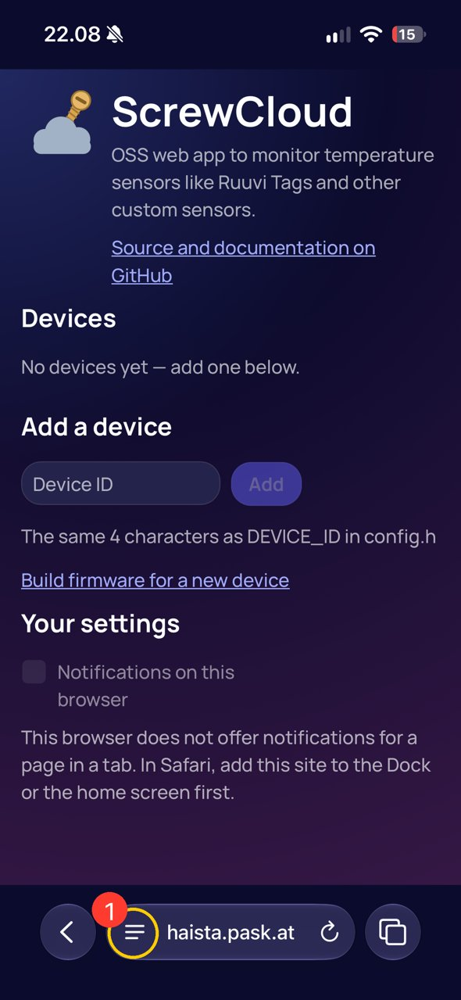
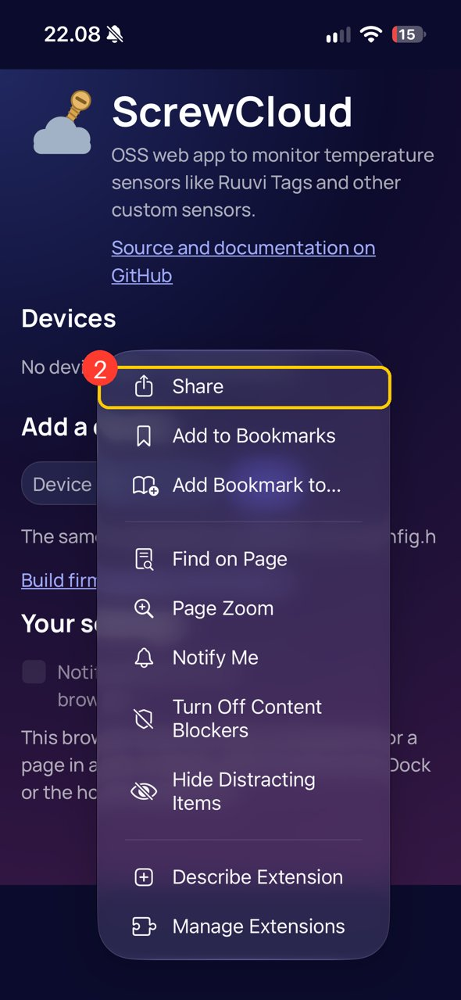
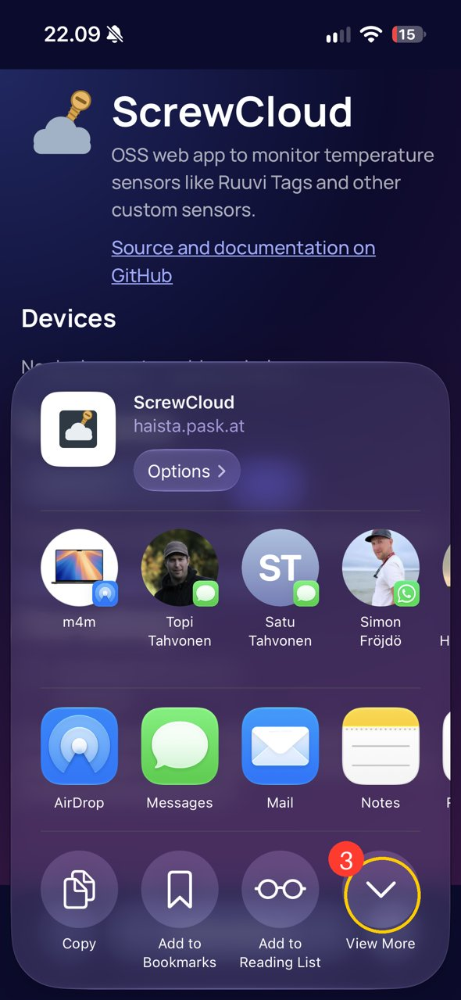
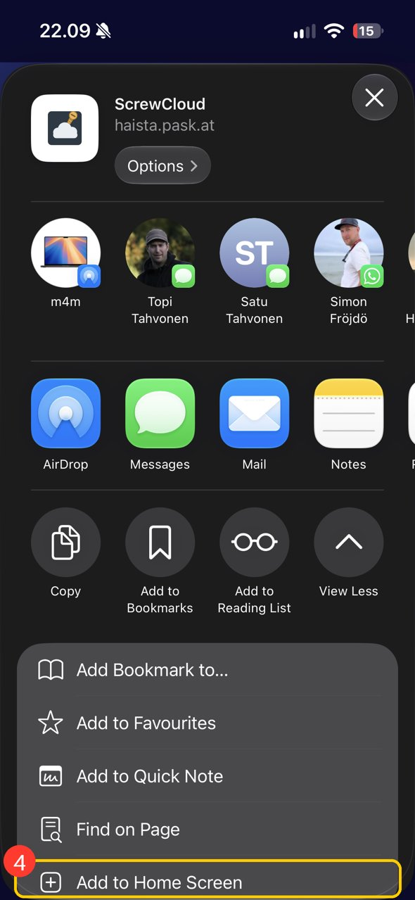
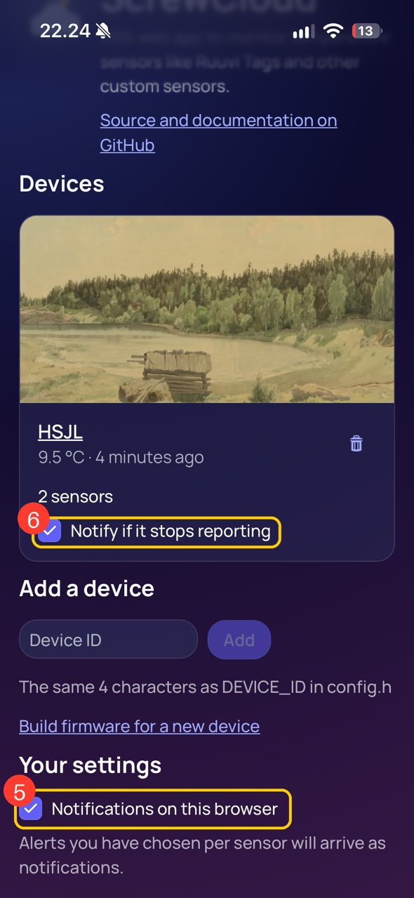
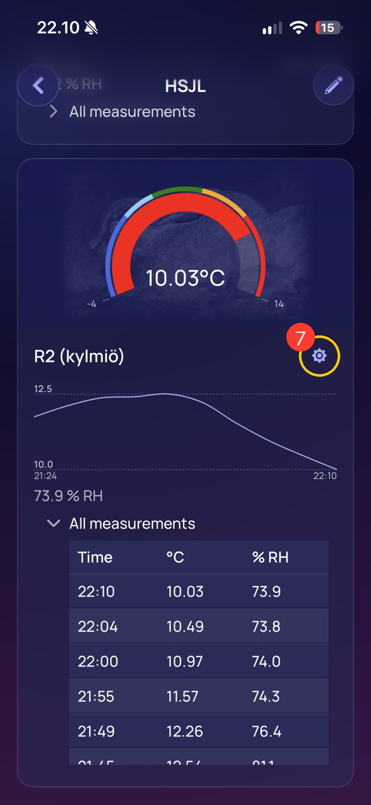
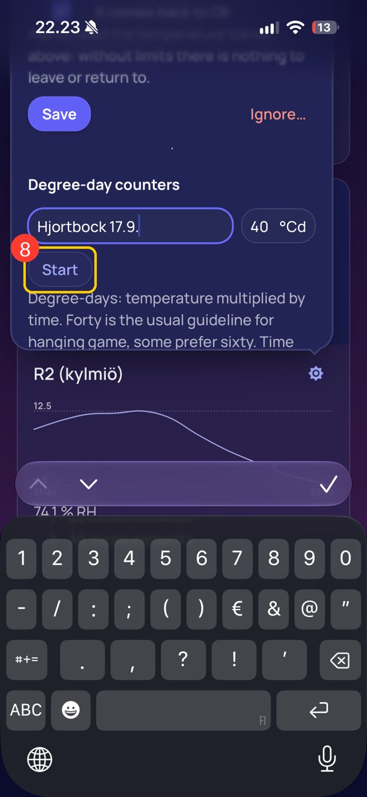
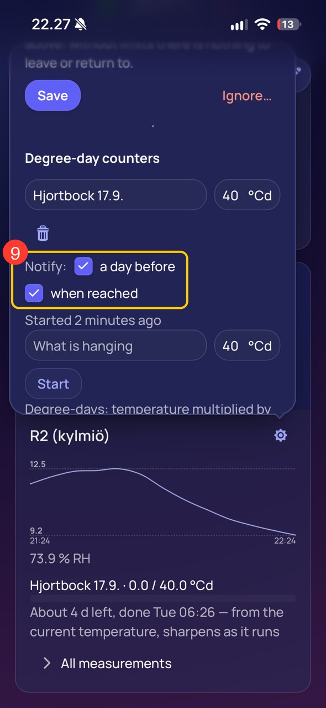
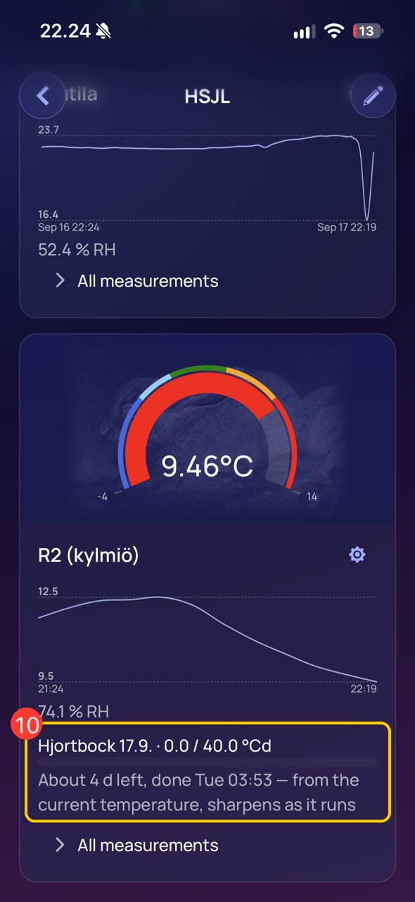

# Getting a notification on an iPhone before the meat turns into jerky

A walk-through, with pictures, of the whole path for a new user: from a
ScrewCloud page in Safari to a phone that buzzes when the shed is about to be
ready. It exists because of one Apple decision, so let us start there.

## Why this needs a guide at all

Web push notifications work in every major browser — except that on an iPhone
they work only for a web app that has been **added to the Home Screen**. A page
in a Safari tab is not allowed to notify you, no matter how nicely it asks. Apple
introduced this in iOS 16.4 (2023), five years after everyone else, and made sure
nothing on the page can offer the install: there is no prompt, no button a site
can show, and the option lives three taps deep in a menu whose top half is
people you could send the page to.

Whether this is about your battery or about the App Store's thirty per cent is
a question for the courts, and they are on it. Until they finish, the recipe
below is the recipe.

**Android users:** Chrome offers to install the app on its own, and notifications
work from a plain tab too. You can skip to [step 5](#5-switch-notifications-on);
everything from there on is the same.

## 1. Open the menu in the address bar

Open the site in Safari. At the bottom, in the address bar, tap the **☰** icon
to the left of the address. Not the share arrow — there is no share arrow here
any more; iOS 18 put it inside this menu.

Notice the message under **Your settings**: the page already knows it cannot
notify you from a tab, and says what to do about it.

## 2. Share — with yourself

Tap **Share**. The name is odd for what we are about to do, but this is where
Apple keeps it.

## 3. Look past the people

The share sheet opens with your contacts and your apps. The thing we want is not
among them. Scroll the bottom row of round buttons and tap **View More**.

## 4. Add to Home Screen

There it is, at the very bottom: **Add to Home Screen**. Tap it, then **Add** in
the top right corner of the dialog that follows (you can rename it first if you
like).

A ScrewCloud icon appears among your apps. **Close Safari and open that icon
from now on.** It is the same site, but iOS treats it as a separate app — and
that is the whole trick: this one is allowed to notify you.

> One consequence worth knowing: the Home Screen app is a separate browser with
> its own memory. Devices you added while still in Safari are not there — add
> them again inside the app. Do everything below in the app, and do it once.

## 5. Switch notifications on

In the app, add your device by its four-character ID if you have not yet, then
scroll down to **Your settings** and tick **Notifications on this browser**. iOS
asks whether ScrewCloud may send notifications; say **Allow**. (If you refused
once, the switch is now in Settings → Notifications → ScrewCloud, like any app.)

While you are here: **Notify if it stops reporting** on the device's card (6)
tells you when the device itself goes quiet — a dead battery, a router someone
unplugged — which is a different thing from the temperature being wrong, and
worth knowing before a weekend.

## 6. Open the sensor's settings

Tap the device to open it. Each sensor is a card; tap the **cog** on the card of
the thermometer that hangs where the meat hangs.

The settings hold a name for the sensor, the temperature bands that colour the
gauge, and — under **Notify this browser when** — the alerts about the
temperature itself: too warm, too cold, back to normal. Tick what you want and
press **Save**. Those are the alerts for a thermometer; the counter below is the
one for the meat.

## 7. Start a degree-day counter

Under **Degree-day counters**, write what is hanging and since when (the date
helps when there are two), leave the target at 40 °Cd unless you know better,
and tap **Start**. The counter starts from this moment — start it when the meat
goes up.

Degree-days are temperature multiplied by time: five days at +8 °C and eight
days at +5 °C are the same forty. Time below freezing counts for nothing, and
above +10 °C you should be worrying about bacteria rather than tenderness. Forty
is the usual guideline for game; some prefer sixty for more flavour.

## 8. Choose what the counter tells you

The running counter shows its own two notifications, both on by default: **a day
before** the target, judged from the current temperature, and **when reached**.
Untick what you do not want. Changes here save themselves; there is nothing to
press.

## 9. Watch it on the card

Close the settings. The card now carries the counter: the sum so far against the
target, and a forecast — *about 4 days left, done Tuesday morning*. The
forecast is what you actually came for; it sharpens as the counter gathers its
own readings.

When the target is passed the card says so with a green badge and keeps
counting, because the meat is still hanging until you take it down. Stop the
counter from the cog when it does.

## What arrives, and when

| Notification | When |
|---|---|
| *About a day left* | the forecast says the target is about 24 hours away |
| *Target reached* | the sum passes the target |
| temperature alerts | the sensor crosses a band you set, and again when it comes back |
| *Stopped reporting* | the device has been silent for longer than its usual interval |

Each one is sent once — a counter that passed its target on Tuesday does not
announce it again on Wednesday. Notifications are per phone: two people watching
the same shed each choose their own, but the counter itself is shared, because
what hangs there is a fact and not a preference.

## If nothing arrives

- **Are you in the app?** Notifications never arrive for a page open in Safari, and
  the switch there says so. Open the Home Screen icon.
- **Did iOS get its answer?** Settings → Notifications → ScrewCloud must allow them.
- **Is the phone in Focus?** A Focus mode silences web apps like everything else.
- **Is the server able to notify at all?** If the switch under Your settings is
  missing altogether, the server has not been given its push keys — see the README
  under *Web push notifications*.
